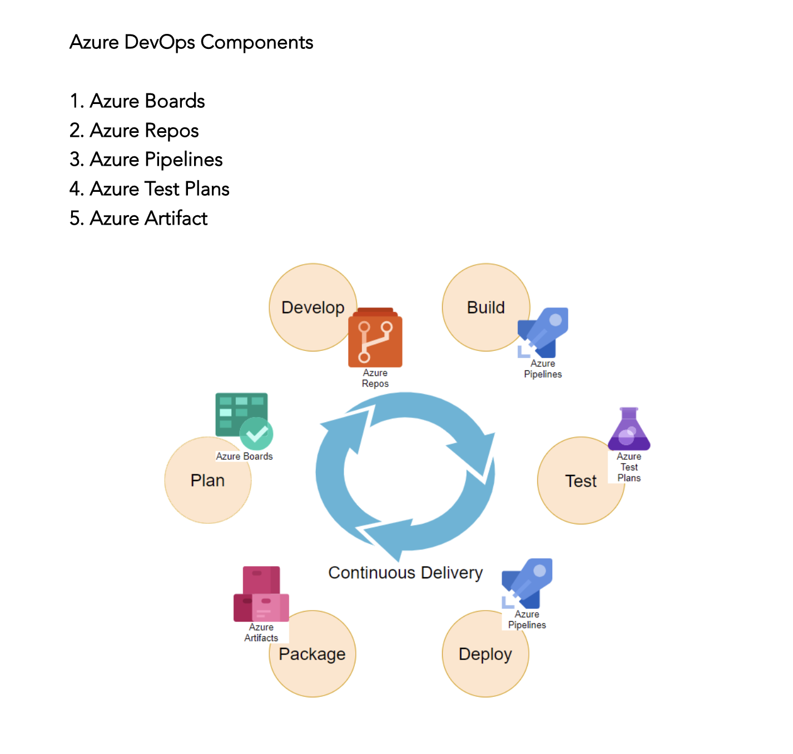

# LetsDevOps: Introduction to Azure DevOps for Beginners - Create CI/CD Pipelines, Setup Repository

## Introduction

DevOps is a process which helps to enable continuous delivery of value to our end users. Delivery of Software is a process of Planning, 
Developing, Build, Test, Deploy and Retrospective. Azure DevOps gives all these capabilities to achieve the Continuous Delivery under a single platform.

## Azure DevOps Components

1. Azure Boards

 This component helps to plan your Backlog, Sprint and track it across the team.

2. Azure Repos

This helps to manage the Code Repository with unlimited private Git Repo. It can be integrated with Centralized [TFS] as well as decentralized [Git] repository with Source Code Management 

3. Azure Pipelines

This is very important feature for the DevOps practice. Azure Pipelines helps to setup the  [CI/CD] 
Continuous Integration and Continuous Deployment. The beauty of this component is that it can be used for any platform like Windows, Linux, Mac OS as well as with any Cloud provider.

4. Azure Test Plans

This component helps to integrate the TestPlans for your application to validate the changes before shipping to the Customer.

5. Azure Artifact

Azure Artifact helps to create package which can be shared by different Teams also this can be integrated with CI/CD pipeline.

