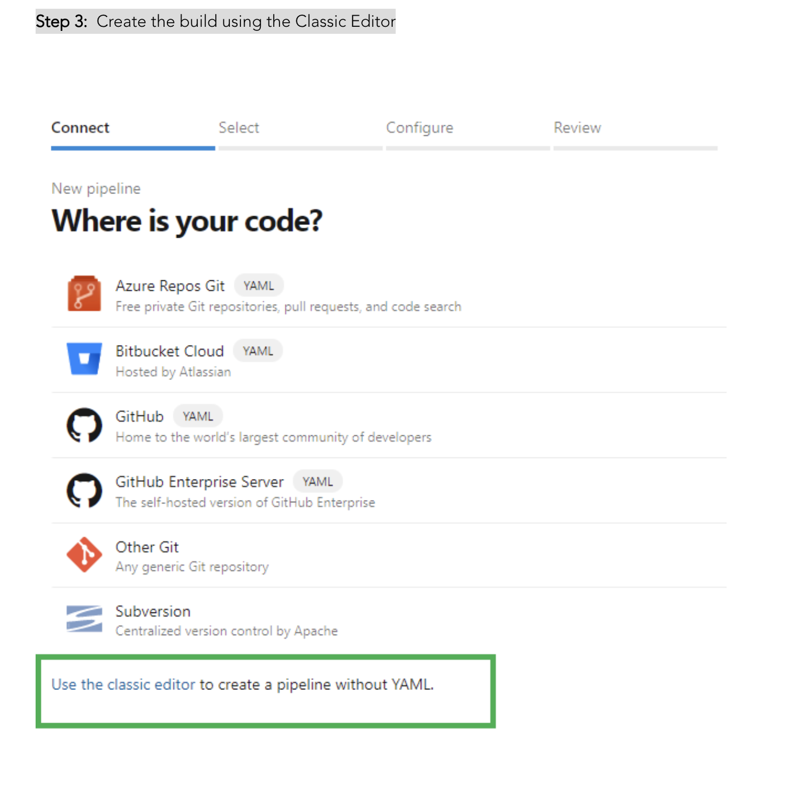

# LetsDevOps: Introduction to Azure DevOps for Beginners - Create CI/CD Pipelines, Setup Repository

## Introduction

DevOps is a process which helps to enable continuous delivery of value to our end users. Delivery of Software is a process of Planning, 
Developing, Build, Test, Deploy and Retrospective. Azure DevOps gives all these capabilities to achieve the Continuous Delivery under a single platform.

## Azure DevOps Components

1. Azure Boards

 This component helps to plan your Backlog, Sprint and track it across the team.

2. Azure Repos

This helps to manage the Code Repository with unlimited private Git Repo. It can be integrated with Centralized [TFS] as well as decentralized [Git] repository with Source Code Management 

3. Azure Pipelines

This is very important feature for the DevOps practice. Azure Pipelines helps to setup the  [CI/CD] 
Continuous Integration and Continuous Deployment. The beauty of this component is that it can be used for any platform like Windows, Linux, Mac OS as well as with any Cloud provider.

4. Azure Test Plans

This component helps to integrate the TestPlans for your application to validate the changes before shipping to the Customer.

5. Azure Artifact

Azure Artifact helps to create package which can be shared by different Teams also this can be integrated with CI/CD pipeline.

## Account Setup

If you do not have Azure DevOps setup you can start for free but you need to sign up using any valid account. Follow below link and start for Free.

https://azure.microsoft.com/en-us/services/devops/?nav=min:

# Organization.

Organization is collection of related projects. Also it helps to organize the different Projects.
Once you are signed up there will be Organization created. You can create Multiple Organization with Create New Organization.

# Project
Project helps to build the Software Solution which includes Planning, Tracking,
Source Code Management, Setting Up CI/CD, Releasing Artifact. Once you create Project team will be created Automatically.
Under the Organization you can create Project.

## Create Project
Organization --> New Project --> Create

# Azure Repos

Azure Repos helps to create and Manage Source Code which further will be used to Build and Deploy.
For example we can import any sample Project to setup the CI/CD. Use below git repo to import.

#  Azure Pipelines

Once the Source Control setup is completed now we can setup the Continuous Integration and Continuous Deployment

8-) `Continuous Integration`

Continuous Integration is a process to setup the Build for your application Project, which enables to trigger build pipeline
automatically on each source code Check-In. This helps to track the Build status and and identify build failure caused by specific change.
Lets setup the CI step by Step.

Step :1 Create Build Pipeline

Pipelines --> Create Pipeline

Step 2:  Select the respective repository and the branch.

Step 3:  Create the build using the Classic Editor

Step 4:  Use the ASP.NET Build template since the Sample Repo is ASP.NET web Application.

Step 5: Save the Pipeline and Queue the Build.

Step 6: If you get below error it mean the Free tier is not approved by Microsoft. If you are using MSDN Account you will not receive this error;

Solution 1: To solve this error you need to send email to Microsoft. Follow below instruction.

Private Project:

You could send email to azpipelines-freetier@microsoft.com in order to get your free tier.

Your name

Name of the Azure DevOps organization

Public Project:

You could send email to azpipelines-ossgrant@microsoft.com in order to get your free tier.

Your name

Azure DevOps organization for which you are requesting the free grant

Links to the repositories that you plan to build

Brief description of your project

Solution 2: If you have self hosted agent you can configure to run the Build. In my case I will use configured self hosted Agent.

If you want to learn on How to Configure Self Hosted Agent please follow below article.

https://www.letsdevops.net/post/azure-devops-configure-self-hosted-agent-on-the-azure-devops

Demo: https://www.youtube.com/watch?v=zWwnXR5CqYM&t=170s

Step 7: Once you configured the Agent you can update the pipeline to run with self Hosted Agent Pool.

Step 8: Save and queue the Build and on successful run you will see the output like below.

Step 9: Now you can enable the Continuous Integration and save the changes. With this changes on each check-in the Build will be triggered.

Edit Pipeline --> Triggers --> Enable continuous integration

8-) `Continuous Deployment`

Continuous deployment is a process to deploy the changes on the different environment.

Once the Build (CI) is completed now its time to deploy the package. This will help to make your application available for use.

Step 1: Create Release Pipeline

Step 2: Since we have build the ASP.NET Solution. I will be selecting the below IIS Website Deployment template.

Step 3: Now we need to configure the deployment group. Deployment group is the collection of Machine on which deployment will run.
With this required package will be deployed to the respective target machine.

Step 4: Click on the Setting Button and create the Group.

Step 5:  Once group created now you will see PowerShell command that needs to be run on the machine where you want to deploy the Application.

Step 6: Open PowerShell as admin on the deployment machine and run the script.

Step 7: Once the Deployment Machine is configured you can see it Online.

Step 7: Now Complete the Release pipeline setup and save the changes after adding the deployment group details. Required Tag you can setup during t

Step 8: Add the Artifact so that it will use the package which created during the CI.

Step 9:  Create Release and deploy it.

Step 10: On Successful deployment you can see the Stage Deployment completed.

Step 11: Enable the Continuous Deployment

Edit Release Pipeline --> Trigger --> Enabled

Continuous Integration and Continuous Deployment Simulation.

Since the CI and CD is enabled and now I will make a simple check -in in the Source Repository and that will trigger the Build as well as deployment without any human intervention.

For more watch this video

[YAML Pipeline Tutorial](https://www.youtube.com/watch?v=h-KVX1lADxw)
